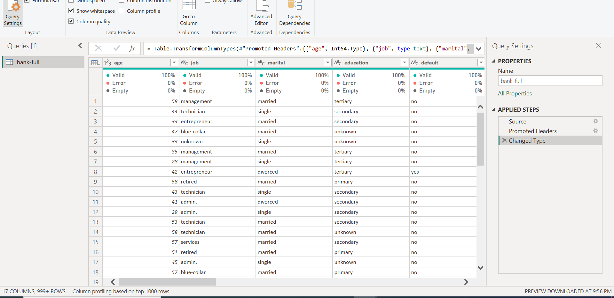
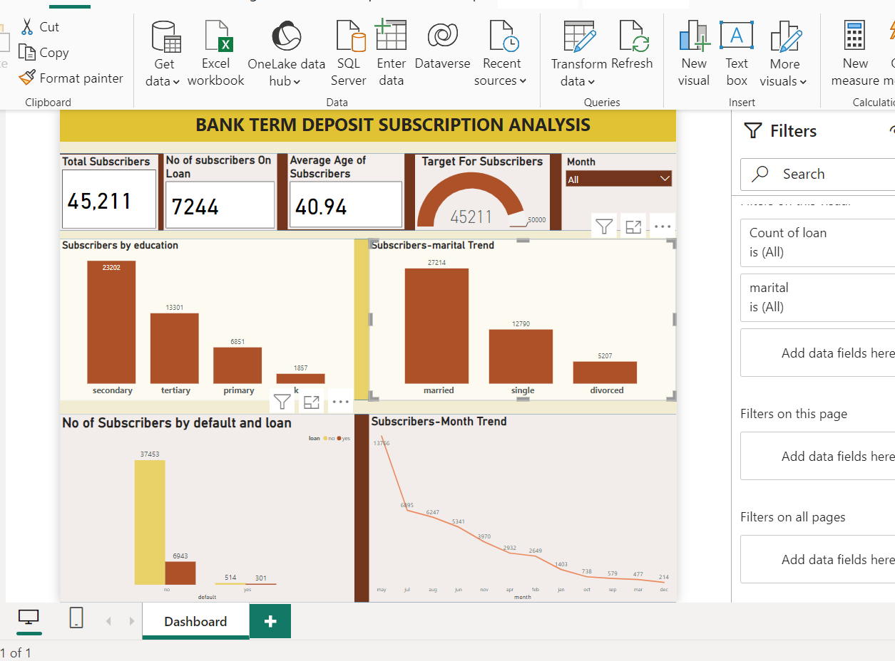

# Bank-Term-Deposit-Subscription-Dashboard

## Introduction

In this Power Bi Task, We were Provided with a Dataset called BankFull in CSV Format. The project is to learn how to create a Dashboard.

**_Disclamier_**:_All Dataset do not represent any individual, Institution or company ,but just a dummy set to demonstrate my knowledge of Power Bi._

## Skill/ Concepts Documented
  - Power Query Editor
  - Visuals

## Problem Solved
1. Import the data into the query
- Check the Column quality and Column distribution.
- Everything was ok
- It was a clean dataset

2. Create a Dashboard
- Create four KPIs
1. Total Subscribers = Count(Loan) = 45,211; Visualized with Card(New)
2. No Of Subscribers on loan = Count(Loan), Filter (Yes) = 7224; Visualized with Card (New)
3. Target For Subscribers = count ( Loan)= 45211, Target at 50000; Visualized with Gauge
4. Slicer For Month.

- Four Questions for better insight
1. what is the number of subscribers by there education?
2. Subscriber By Marital Stautus.
3. Subscribers By default and loan.
4. The Subscriber Month Trend.

Dashboard 

